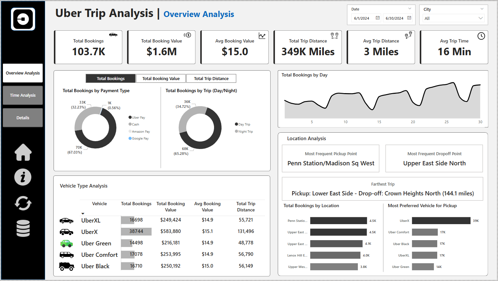
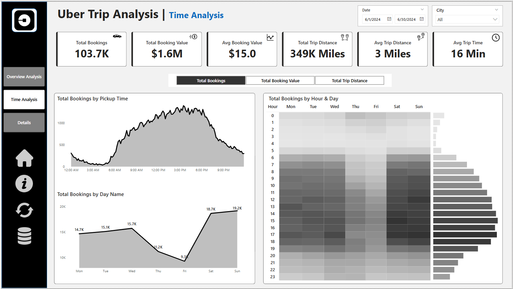
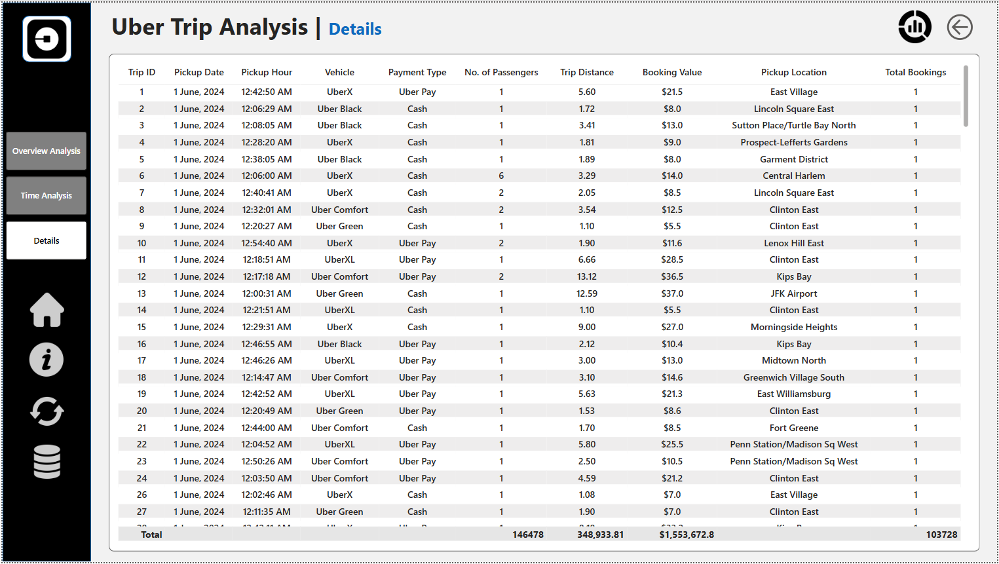

# 🚕 Uber Trip Analysis Dashboard | Power BI

## 📌 Project Overview

This Power BI project analyzes Uber trip data to uncover booking trends, revenue performance, and trip efficiency. With interactive dashboards and dynamic visuals, the solution enables stakeholders to make data-driven decisions around pricing, operations, and customer experience.

---

## 📊 Dashboard Breakdown

### 🧭 Dashboard 1: Overview Analysis

**Objective:**  
Summarize key performance metrics, booking behavior, and trip efficiency.

**Key KPIs:**
- Total Bookings  
- Total Booking Value  
- Average Booking Value  
- Total Trip Distance  
- Average Trip Distance  
- Average Trip Time  

**Core Insights:**
- Identify booking/revenue trends over time
- Understand customer travel habits
- Compare trip metrics across cities, time, and vehicle types

**Features:**
- **Dynamic Measure Selector:** Total Bookings, Booking Value, Trip Distance  
- **Filters:** Payment Type, Trip Type (Day/Night), City, Date  
- **Vehicle Type Grid View:** KPI comparison across vehicle types with conditional formatting  
- **Location Analysis:**  
  - Most frequent pickup/drop-off points  
  - Farthest trip  
  - Top 5 booking locations  
  - Preferred vehicles by location  

**UX Enhancements:**
- Tooltips with added metrics (e.g., Avg Booking Value)  
- Bookmark for Data Details (definitions, data model, refresh frequency)  
- Clear Filters Button  
- Download Raw Data Button (CSV/Excel export)

---

### 🕒 Dashboard 2: Time Analysis

**Objective:**  
Analyze ride demand patterns over time to support pricing, resource allocation, and scheduling.

**Visualizations:**
- **Pickup Time (10-min intervals):** Area chart to detect peak hours  
- **Day Name Trends:** Line chart (Monday–Sunday)  
- **Hourly Heatmap:** Matrix visual of booking activity by hour/day

**Dynamic Global Measure:**
- Total Bookings  
- Total Booking Value  
- Total Trip Distance  

All visuals update based on selected measure for consistent insights.

---

### 📋 Dashboard 3: Details Tab

**Objective:**  
Provide drill-through capability and raw data exploration.

**Features:**
- Grid table with trip records and filters  
- Drill-through from other dashboards (charts → data)  
- **Bookmark for Full View:** Toggle between filtered and full data

---

## 🧰 Tools & Technologies

- **Power BI Desktop** – Dashboard creation  
- **DAX & Data Modeling** – Dynamic measures and relationships  
- **Bookmarks, Tooltips, Buttons** – Enhanced interactivity  

---

